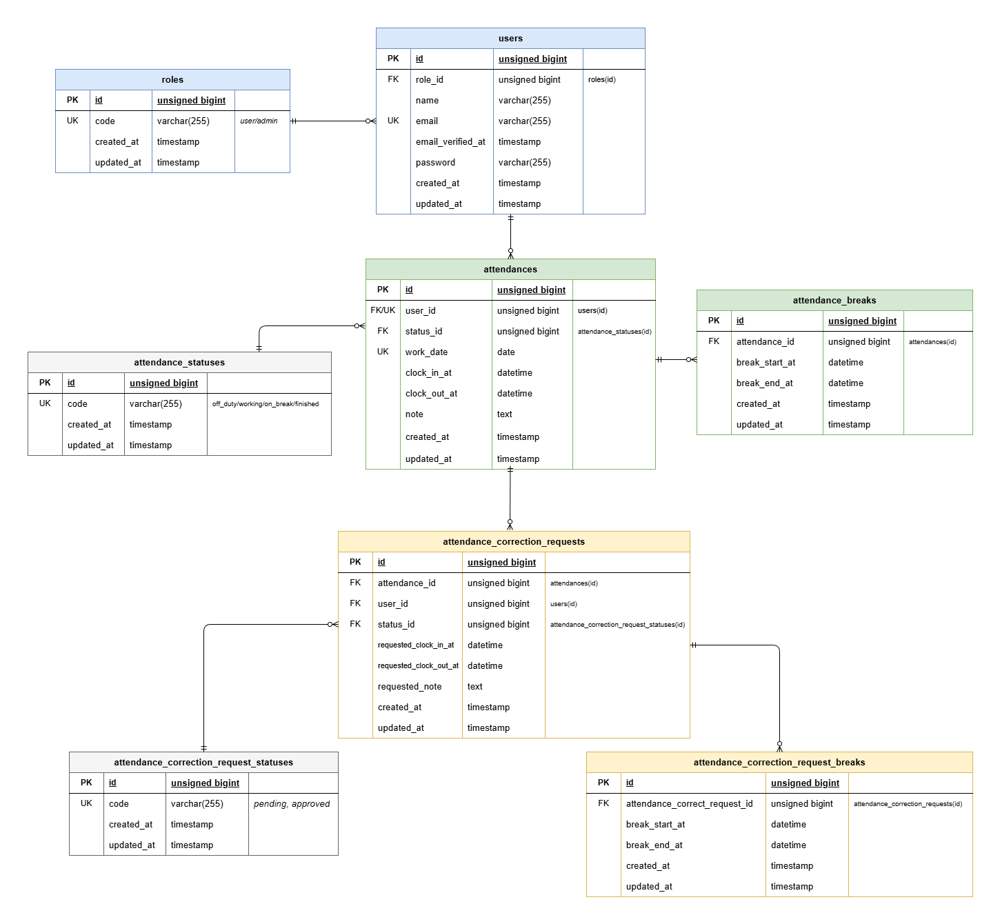

# 勤怠管理アプリ

## 環境構築
#### 1. リポジトリをクローン
```bash
git clone git@github.com:ando1221/attendance-record
cd attendance-record
```
#### 2. Dockerコンテナをビルド・起動
```bash
docker compose up -d --build
```
#### 3. PHPコンテナに入る
```bash
docker compose exec php bash
```
#### 4. Laravelをインストール
```bash
composer install
```
#### 5. .env を作成して環境変数を設定
```bash
cp .env.example .env
```
```env
DB_CONNECTION=mysql
DB_HOST=mysql
DB_PORT=3306
DB_DATABASE=laravel_db
DB_USERNAME=laravel_user
DB_PASSWORD=laravel_pass

MAIL_MAILER=smtp
MAIL_HOST=mailhog
MAIL_PORT=1025
MAIL_USERNAME=null
MAIL_PASSWORD=null
MAIL_ENCRYPTION=null
MAIL_FROM_ADDRESS=test@example.com
MAIL_FROM_NAME="${APP_NAME}"
```

#### 6. アプリケーションキーを生成
```bash
php artisan key:generate
```

#### 7. マイグレーション & シーディング
```bash
php artisan migrate:fresh --seed
```

> 権限設定について（初回のみ）

Docker 環境で Laravel を起動する際、<br>
storage および bootstrap/cache ディレクトリに書き込み権限が無く<br>
エラーが発生する場合があります。<br>
<br>
その場合は、php コンテナ内で storage と bootstrap/cache に<br>
書き込み権限を付与することでアプリケーションが正常に動作します。<br>

※ 本設定はローカル開発環境向けです。<br>

## 使用技術(実行環境)
- PHP 8.x
- Laravel 8.x
- MySQL 8.0
- Nginx 1.21
- MailHog
- Docker / Docker Compose
## URL
- 一般ユーザーログイン画面：http://localhost/login<br>
- 一般ユーザー会員登録画面：http://localhost/register<br>

- 管理者ログイン画面：http://localhost/admin/login<br>

- MailHog：http://localhost:8025<br>

- phpMyAdmin：http://localhost:8080/<br>

## シーディング内容

初期設定データとして以下を登録しています。<br>
- 権限データ（roles）<br>
- 勤怠状態データ（attendance_statuses）<br>
- 修正申請状態データ（attendance_correction_request_statuses）<br>

デモデータとして以下を登録しています。<br>
- 管理者ユーザー<br>
- 一般ユーザー<br>
- 2026年4月・5月・6月の勤怠データ<br>
- 修正申請データ（承認待ち / 承認済み）<br>

### テスト用アカウント

**管理者ユーザー**<br>
email: admin@example.com<br>
password: password<br>

**一般ユーザー1**<br>
email: staff1@example.com<br>
password: password<br>

**一般ユーザー2**<br>
email: staff2@example.com<br>
password: password<br>

## テーブル定義

<details><summary>テーブルを表示する</summary>

### 1. roles<br>
権限マスタを管理するテーブルです。

| 論理名 | カラム名 | 型 | PK | NOT NULL | UNIQUE | FK |
|---|---|---|---|---|---|---|
| 権限ID | id | unsigned bigint | ○ | ○ |  |  |
| user / admin | code | varchar(255) |  | ○ | ○ |  |
| 作成日時 | created_at | timestamp |  |  |  |  |
| 更新日時 | updated_at | timestamp |  |  |  |  |

---

### 2. users
ユーザー情報を管理するテーブルです。

| 論理名 | カラム名 | 型 | PK | NOT NULL | UNIQUE | FK |
|---|---|---|---|---|---|---|
| ユーザーID | id | unsigned bigint | ○ | ○ |  |  |
| 権限ID | role_id | unsigned bigint |  | ○ |  | roles(id) |
| 名前 | name | varchar(255) |  | ○ |  |  |
| メールアドレス | email | varchar(255) |  | ○ | ○ |  |
| メール認証日時 | email_verified_at | timestamp |  |  |  |  |
| パスワード | password | varchar(255) |  | ○ |  |  |
| 作成日時 | created_at | timestamp |  |  |  |  |
| 更新日時 | updated_at | timestamp |  |  |  |  |

---

### 3. attendance_statuses
勤怠本体の状態マスタを管理するテーブルです。

| 論理名 | カラム名 | 型 | PK | NOT NULL | UNIQUE | FK |
|---|---|---|---|---|---|---|
| 勤怠状態ID | id | unsigned bigint | ○ | ○ |  |  |
| off_duty / working / on_break / finished | code | varchar(255) |  | ○ | ○ |  |
| 作成日時 | created_at | timestamp |  |  |  |  |
| 更新日時 | updated_at | timestamp |  |  |  |  |

---

### 4. attendances
勤怠情報を管理するテーブルです。  
休憩は1日に何回でも登録できます。

| 論理名 | カラム名 | 型 | PK | NOT NULL | UNIQUE | FK |
|---|---|---|---|---|---|---|
| 勤怠ID | id | unsigned bigint | ○ | ○ |  |  |
| ユーザー | user_id | unsigned bigint |  | ○ |  | users(id) |
| 現在の勤怠状態 | status_id | unsigned bigint |  | ○ |  | attendance_statuses(id) |
| この勤務をどの日の勤務として扱うか | work_date | date |  | ○ | ○ ※ |  |
| 実際の出勤日時 | clock_in_at | datetime |  |  |  |  |
| 実際の退勤日時 | clock_out_at | datetime |  |  |  |  |
| 備考 | note | text |  |  |  |  |
| 作成日時 | created_at | timestamp |  |  |  |  |
| 更新日時 | updated_at | timestamp |  |  |  |  |

※ `user_id` と `work_date` の複合ユニーク制約を想定

---

### 5. attendance_breaks
勤怠に紐づく休憩情報を管理するテーブルです。

| 論理名 | カラム名 | 型 | PK | NOT NULL | UNIQUE | FK |
|---|---|---|---|---|---|---|
| 休憩ID | id | unsigned bigint | ○ | ○ |  |  |
| 対象勤怠ID | attendance_id | unsigned bigint |  | ○ |  | attendances(id) |
| 休憩開始日時 | break_start_at | datetime |  | ○ |  |  |
| 休憩終了日時 | break_end_at | datetime |  |  |  |  |
| 作成日時 | created_at | timestamp |  |  |  |  |
| 更新日時 | updated_at | timestamp |  |  |  |  |

---

### 6. attendance_correction_request_statuses
修正申請の状態マスタを管理するテーブルです。

| 論理名 | カラム名 | 型 | PK | NOT NULL | UNIQUE | FK |
|---|---|---|---|---|---|---|
| 修正申請状態ID | id | unsigned bigint | ○ | ○ |  |  |
| pending / approved | code | varchar(255) |  | ○ | ○ |  |
| 作成日時 | created_at | timestamp |  |  |  |  |
| 更新日時 | updated_at | timestamp |  |  |  |  |

---

### 7. attendance_correction_requests
勤怠修正申請本体を管理するテーブルです。

| 論理名 | カラム名 | 型 | PK | NOT NULL | UNIQUE | FK |
|---|---|---|---|---|---|---|
| 修正申請ID | id | unsigned bigint | ○ | ○ |  |  |
| 対象勤怠ID | attendance_id | unsigned bigint |  | ○ |  | attendances(id) |
| ユーザー | user_id | unsigned bigint |  | ○ |  | users(id) |
| 申請状態 | status_id | unsigned bigint |  | ○ |  | attendance_correction_request_statuses(id) |
| 修正後出勤日時 | requested_clock_in_at | datetime |  |  |  |  |
| 修正後退勤日時 | requested_clock_out_at | datetime |  |  |  |  |
| 修正後備考 | requested_note | text |  |  |  |  |
| 作成日時 | created_at | timestamp |  |  |  |  |
| 更新日時 | updated_at | timestamp |  |  |  |  |

---

### 8. attendance_correction_request_breaks
修正申請に紐づく休憩情報を管理するテーブルです。

| 論理名 | カラム名 | 型 | PK | NOT NULL | UNIQUE | FK |
|---|---|---|---|---|---|---|
| 申請休憩ID | id | unsigned bigint | ○ | ○ |  |  |
| 対象修正申請ID | attendance_correction_request_id | unsigned bigint |  | ○ |  | attendance_correction_requests(id) |
| 修正後休憩開始日時 | break_start_at | datetime |  | ○ |  |  |
| 修正後休憩終了日時 | break_end_at | datetime |  |  |  |  |
| 作成日時 | created_at | timestamp |  |  |  |  |
| 更新日時 | updated_at | timestamp |  |  |  |  |
</details>

## ER図
<details><summary>ER図を表示する</summary>



</details>

## 自動テスト実行手順
#### 1. テスト用 .env を作成して環境変数を設定
```bash
docker compose exec php bash
cp .env .env.testing
```
```env
APP_ENV=testing
APP_KEY=
APP_DEBUG=true
APP_URL=http://localhost

DB_CONNECTION=mysql
DB_HOST=mysql
DB_PORT=3306
DB_DATABASE=laravel_test_db
DB_USERNAME=laravel_user
DB_PASSWORD=laravel_pass

```
#### 2. テスト用データベースを作成する
```bash
docker compose exec mysql bash
mysql -u root -p
```
```sql
CREATE DATABASE IF NOT EXISTS laravel_test_db;
GRANT ALL PRIVILEGES ON laravel_test_db.* TO 'laravel_user'@'%';
FLUSH PRIVILEGES;
```
#### 3. アプリケーションキーを生成する
```bash
php artisan key:generate --env=testing
```
#### 4. テストを実行する
> すべて実行する場合
```bash
php artisan test
```
> 特定ファイルのみ実行する場合
```bash
php artisan test tests/Feature/ディレクトリ名/ファイル名
```
> 特定テストのみ実行する場合
```bash
php artisan test --filter=テスト名
```
